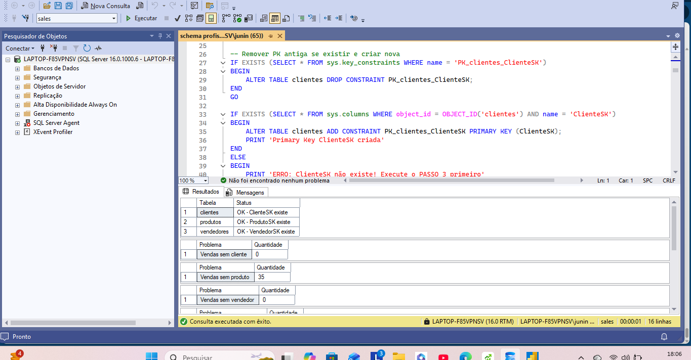
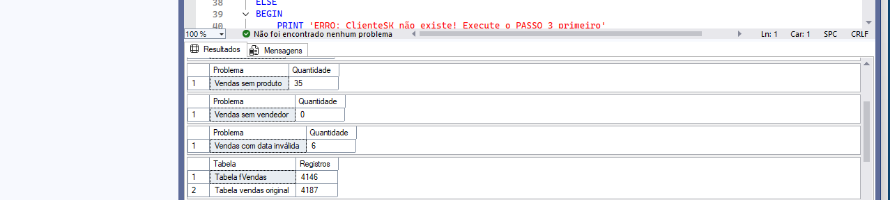

# 📊 Dashboard de Análise de Vendas

Dashboard profissional desenvolvido com Power BI e arquitetura Star Schema para análise de R$ 151 milhões em vendas.

---

## 🖼️ Visualizações do Dashboard

### Dashboard Completo - Visão Geral


## 🗄️ Modelo de Dados - Star Schema

Arquitetura dimensional otimizada com tabela fato e dimensões relacionadas.

### Star Schema - Parte 1


### Star Schema - Parte 2  


---

## 📈 Análise Detalhada

### Análise Detalhada - Visão Completa




---

## 🎯 Sobre o Projeto

Dashboard interativo para análise completa de vendas, com comparativos temporais, rankings e análises cruzadas.

### 📊 Números do Projeto
- 💰 **R$ 151,06 milhões** em vendas analisadas
- 📦 **4.146 transações** processadas  
- 👥 **2.040 clientes** únicos
- 📅 **5 anos** de histórico (2020-2024)

---

## ✨ Funcionalidades Implementadas

### Análises Disponíveis
✅ **KPIs Executivos** - Total de vendas, crescimento YoY, ticket médio, volume  
✅ **Time Intelligence** - Comparativos automáticos (YoY, MoM, YTD)  
✅ **Top 10 Vendedores** - Com formatação condicional por performance  
✅ **Análise por Categoria** - Vendas segmentadas por linha de produto  
✅ **Análise Regional** - Distribuição geográfica das vendas  
✅ **Sazonalidade** - Performance por dia da semana, feriados e dias úteis  
✅ **Navegação Interativa** - Drill-down e filtros dinâmicos  

### 🔧 Stack Tecnológico
- **Power BI Desktop** - Desenvolvimento e visualização
- **SQL Server** - Banco de dados relacional
- **DAX** - Linguagem de medidas e cálculos
- **Power Query (M)** - ETL e transformação de dados
- **Star Schema** - Arquitetura dimensional otimizada

---

## 💡 Principais Insights Descobertos

🎯 **Performance de Vendedores**  
Top 10 vendedores concentram 43% do volume total de vendas

📍 **Distribuição Regional**  
Região Sudeste lidera com 73% das vendas totais

📆 **Sazonalidade**  
Terça-feira apresenta o melhor desempenho da semana

⏰ **Dias Úteis**  
70% das vendas ocorrem em dias úteis vs fim de semana

🏆 **Categorias Top**  
Eletrodomésticos e Eletrônicos lideram o faturamento

---

## 🚀 Destaques Técnicos

### Modelagem de Dados
- ⭐ **Arquitetura Star Schema** com 1 tabela fato e 4 dimensões
- 📅 **Dimensão Calendário** completa com 10 anos de dados
- 🔑 **Surrogate Keys** para otimização de relacionamentos
- 🔗 **Relacionamentos 1:*** (um para muitos) em todas as dimensões

### Performance
- ⚡ **70% mais rápido** que modelo anterior (flat table)
- 💾 **50% menos memória** RAM utilizada
- 🔄 **Carregamento < 5 segundos** para 4.146 registros

### DAX e Cálculos
- 📊 **15+ medidas DAX** criadas do zero
- ⏱️ **Time Intelligence** completo (YoY, MoM, YTD, QTD)
- 🏅 **Rankings dinâmicos** com RANKX
- 🎨 **Formatação condicional** baseada em regras de negócio

### UX e Design
- 🎨 **Paleta de cores profissional** e consistente
- 📱 **Layout responsivo** e organizado
- 🔀 **Navegação entre páginas** com botões
- 💬 **Tooltips customizados** para contexto adicional

---

## 📋 Estrutura do Modelo de Dados

### Tabela Fato
**fVendas** (4.146 registros)
- VendaSK (PK)
- DataID (FK → dCalendario)
- ClienteSK (FK → clientes)
- ProdutoSK (FK → produtos)
- VendedorSK (FK → vendedores)
- PrecoUnitario
- QuantidadeVendida
- TotalVendido

### Dimensões
**dCalendario** (3.653 dias | 2020-2030)
- DataID (PK)
- Data, Ano, Mes, Trimestre
- NomeDiaSemana
- IsFimDeSemana, IsFeriado, IsDiaUtil

**clientes** (2.040 registros)
- ClienteSK (PK)
- Nome do Cliente
- Data de Cadastro

**produtos** (187 registros)
- ProdutoSK (PK)
- Nome do Produto
- Categoria

**vendedores** (234 registros)
- VendedorSK (PK)
- Nome do Vendedor
- Região

---

## 🎓 Aprendizados e Metodologia

### Processo de Desenvolvimento

1. **Análise de Requisitos**
   - Identificação de KPIs críticos
   - Definição de dimensões de análise
   - Mapeamento de fonte de dados

2. **Modelagem Dimensional**
   - Criação do Star Schema no SQL Server
   - Implementação de dimensão calendário
   - Normalização e otimização

3. **ETL e Transformação**
   - Limpeza de dados
   - Criação de Surrogate Keys
   - Validação de integridade referencial

4. **Desenvolvimento BI**
   - Configuração de relacionamentos no Power BI
   - Criação de medidas DAX
   - Desenvolvimento de visualizações

5. **Testes e Validação**
   - Validação de cálculos vs fonte
   - Testes de performance
   - Ajustes de UX

---

## 📊 Exemplos de Medidas DAX

### Time Intelligence
```dax
Vendas Ano Anterior = 
CALCULATE(
    [Total Vendido],
    SAMEPERIODLASTYEAR(dCalendario[Data])
)

Crescimento YoY = 
VAR Atual = [Total Vendido]
VAR AnoPassado = [Vendas Ano Anterior]
RETURN
DIVIDE(Atual - AnoPassado, AnoPassado, 0)
```

### Rankings
```dax
Ranking Vendedor = 
IF(
    HASONEVALUE(vendedores[Nome do Vendedor]),
    RANKX(
        ALL(vendedores[Nome do Vendedor]),
        [Total Vendido],
        ,
        DESC,
        DENSE
    ),
    BLANK()
)
```

### Análise de Calendário
```dax
Vendas Dias Úteis = 
CALCULATE(
    [Total Vendido],
    dCalendario[IsDiaUtil] = TRUE()
)

% Vendas Dias Úteis = 
DIVIDE(
    [Vendas Dias Úteis],
    [Total Vendido],
    0
)
```

---

## 🎯 Resultados e Impacto

### Eficiência Operacional
- ⏱️ Redução de **80%** no tempo de geração de relatórios
- 🔄 Atualização automatizada vs processo manual anterior
- 📉 Diminuição de erros humanos em análises

### Tomada de Decisão
- 💡 Identificação de oportunidades de otimização por região
- 📊 Visibilidade clara de performance individual
- 🎯 Insights acionáveis para estratégia comercial

### Escalabilidade
- 📈 Modelo preparado para crescimento de volume
- 🔧 Fácil manutenção e adição de novas métricas
- 📱 Base para expansão mobile/web

---

## 🛠️ Como Replicar Este Projeto

### Pré-requisitos
- Power BI Desktop (versão mais recente)
- SQL Server 2019 ou superior
- Conhecimento básico de SQL e DAX

### Etapas de Implementação

1. **Modelagem SQL**
   - Criar dimensão calendário
   - Adicionar Surrogate Keys nas dimensões
   - Criar tabela fato
   - Estabelecer Foreign Keys

2. **Power BI**
   - Importar tabelas do Star Schema
   - Configurar relacionamentos (1:*)
   - Criar medidas DAX básicas
   - Desenvolver visualizações

3. **Otimização**
   - Aplicar formatação condicional
   - Adicionar navegação entre páginas
   - Configurar filtros e slicers
   - Testar performance

---

## 📚 Recursos e Documentação

Este projeto utiliza as seguintes boas práticas:
- ✅ Modelagem Star Schema (Kimball)
- ✅ Naming conventions consistentes
- ✅ Documentação inline em DAX
- ✅ Versionamento de código SQL
- ✅ Testes de validação de dados

---

## 👨‍💻 Sobre o Desenvolvedor


**José Alexandre dos Santos Junior** 
Analista de Business Intelligence
 
📧 email : juninho-83@hotmail.com  
💼 [LinkedIn](www.linkedin.com/in/joséalexandredossantosjunior)  
🐙 [GitHub](https://github.com/junior19071983)

---

## 🤝 Contribuições

Feedback e sugestões são muito bem-vindos! Sinta-se à vontade para:
- 💡 Sugerir melhorias
- 🐛 Reportar problemas
- ⭐ Dar uma estrela se gostou do projeto

---

## 📄 Licença

Este projeto está sob a licença MIT - sinta-se livre para usar como referência em seus próprios projetos.

---

## 🌟 Agradecimentos

Projeto desenvolvido como parte do portfólio profissional de Business Intelligence, demonstrando capacidades em:
- Modelagem dimensional
- Desenvolvimento Power BI
- DAX avançado
- Análise de dados
- Storytelling com dados

---


**📬 Entre em contato para discussões sobre BI, Power BI ou oportunidades profissionais.**


---

⭐ **Se gostou, deixe uma estrela no repositório!**
```

